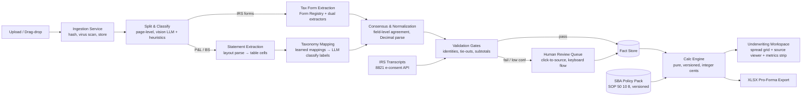

# Credexis V2 — Architecture Blueprint

**SBA 7(a) underwriting automation: documents in, banker-grade pro-forma out.**
Version 1.0 · July 2026 · Companion documents: `POSTMORTEM_V1.md`, `MASTER_TASK_LIST.md`

---

## 1. Product definition

**Users:** SBA loan brokers/packagers and SBA-approved bank employees (BDOs, underwriters, credit analysts).
**Job to be done:** Upload a deal's document stack (business tax returns, personal returns, P&Ls, balance sheets, debt schedules) → get, in minutes, the spread + pro-forma an SBA banker would otherwise build by hand in Excel over hours → verify any number against its source in one click → export a bank-ready workbook.

**MVP scope (a "deal" is):**

- Deal types: business acquisition (change of ownership), working capital/expansion, real-estate purchase, refinance.
- Entities per deal: applicant business, target business (acquisitions), up to N guarantors (with spouses), optional EPC/OC (real-estate holding + operating company) structures.
- Documents: 1120, 1120-S, 1065 (+ K-1s), 1040 (+ Schedules 1, C, E, F), 4562, 8825, 1125-E, W-2, interim + annual P&Ls, balance sheets, debt schedules, purchase agreements (metadata only in MVP).
- Periods: 3 fiscal years + interim (monthly/quarterly/TTM columns supported natively — V1 could not represent these).
- Outputs: financial spread, adjusted cash flow / SDE analysis, global cash flow (guarantor personal), pro-forma debt schedule, DSCR/LTV/liquidity metrics vs SOP 50 10 8 thresholds, XLSX export.

**Out of MVP scope (design seams left open):** E-Tran/lender API submission, credit memo narrative generation, bank statement analysis, collateral valuation, borrower-facing portal.

---

## 2. Non-negotiable design principles

These are laws of the codebase. Each one is the antidote to a specific V1 failure (post-mortem trap # in parens).

1. **LLMs never do arithmetic and never invent values.** LLMs classify, map labels, and locate fields. Every numeric value must be traceable to a bounding box in a source document, an IRS transcript line, or an explicit human input. (Traps 2, 4)
2. **One calc engine, server-side, exact arithmetic.** All money math in a single pure package using integer cents (bigint) with an explicit rounding policy. The client renders — it never computes. (Traps 3, 5)
3. **Every fact carries lineage.** `(value, entity, period, taxonomy_node, source_doc, page, bbox, method, confidence, status)`. No naked numbers anywhere in the system. (Carried forward from V1's one good idea)
4. **Nothing auto-accepted below the confidence bar.** Extraction confidence = extractor agreement × validation-gate results. Fields below threshold go to a human review queue with click-to-source verification. 99% accuracy is achieved by _catching_ the uncertain 5–8%, not by wishing the extractor were perfect. (Traps 9, 11)
5. **Validation gates are blocking and visible.** Accounting identities, subtotal reconciliation, cross-document tie-outs run deterministically after every pipeline run and every override; failures render in the workspace and block auto-accept. (Trap 9)
6. **Positions come from geometry, never from string order.** Values bind to periods via the layout parser's cell coordinates, never by ordinal index. Zero hand-rolled geometry heuristics — layout detection is outsourced to a specialized vendor. (Traps 1, 6, 7)
7. **The golden corpus is the spec.** A labeled set of real documents with ground-truth values gates every merge in CI. If per-field accuracy regresses, the build fails. (Trap 11)
8. **Policy is data, not code.** SBA thresholds (DSCR minimums, equity injection, term limits) live in a versioned Policy Pack — the SOP changes (50 10 8 already revised small-loan rules effective March 2026), and the code must not. (Trap 10)
9. **One language, one repo.** TypeScript monorepo. V1's Python/TS split directly caused triplicated metric logic. (Trap 3)
10. **Every route authenticates. Every table has RLS. No service-role key in request paths.** (Security findings)

---

## 3. System overview



Pipeline runs as durable, resumable jobs (Trigger.dev); every stage writes progress events streamed live to the UI.

---

## 4. Document Intelligence Pipeline (Problem A: IRS forms)

### 4.1 Stage S — Split & classify

Deal uploads arrive as messy combined PDFs (a 90-page scan containing 3 years of returns + statements). Stage S:

- Renders each page → thumbnail; fast vision model (Claude Haiku-class) classifies page type: `{form_family, tax_year, entity_hint, continuation?}` — validated against deterministic signals (IRS form numbers/OMB numbers printed on forms are highly regular).
- Groups contiguous pages into logical documents; detects duplicates by content hash.
- Assigns each logical document to a deal entity (applicant, target, guarantor) — auto-suggested, human-confirmable in the UI.

### 4.2 Stage T — Tax form extraction (dual-path consensus)

The core precision mechanism. Two _independent_ extractors run per form; a deterministic reconciler compares field-by-field.

**Path 1 — Specialized document-AI vendor.**

- Primary recommendation: **Reducto** (strong published results on dense financial layouts, handwriting, low-quality scans; returns bounding boxes + confidence per field; SOC 2; ZDR available). Structured extraction ~$0.015–0.02/page.
- For the 1040 family specifically, **Azure Document Intelligence prebuilt US tax models** (1040 + variants, W-2, 1099s, 1098) are cheap, deterministic, battle-tested — use them as Path 1 for the forms they cover. Business returns (1120/1120-S/1065) are NOT covered by Azure prebuilts → Reducto (or equivalent) with schema-driven extraction.
- Alternates evaluated: **Extend**, **LandingAI ADE** (99.16% DocVQA), **Google Document AI**. The vendor sits behind an **ExtractorAdapter interface** — swapping vendors is a config change, not a rewrite. Benchmark all candidates against the golden corpus in Phase 1 and let the data pick (task list M3.4).

**Path 2 — Frontier vision LLM, schema-constrained.**

- Claude (Sonnet-class) with **structured outputs** against the exact field schema for that (form, tax_year), page images + Path-1 raw text both in context. Prompted to return `null` when a field is absent/illegible — never to guess. Temperature 0.
- Cost: pennies per page. Zero-data-retention API tier (tax docs contain SSNs/EINs).

**The Form Registry (antidote to V1's regex-on-"line 31").**
A versioned data catalog: for each `(form, tax_year)` → the field list with IRS line number, label aliases, page hint, dtype, sign convention, and validation relations (e.g., `f1120s.line21 ≈ line6 - line20`; `f4562.line22 → flows to 1120S.line14`). IRS renumbers lines across years — the registry absorbs that; code never hardcodes a line number. Seeded for the ~15 MVP forms × 3 recent tax years; new forms = new registry entries, no new code.

**Reconciliation.**

- Both paths' values normalized (see 4.4), then compared per field. Agreement → high confidence. Disagreement or single-source-only → review queue with both candidates + source crops shown.
- Independent-extractor agreement is the honest route to 99%: two ~96%-accurate extractors that fail differently yield agreement-filtered precision well above 99%, with the disagreeing ~5–8% of fields routed to a human who resolves them in seconds via the source-crop UI.
- Registry cross-field relations run as a third check (e.g., schedule totals must tie to parent-form lines).

### 4.3 Stage B — Statement extraction (Problem B: P&Ls / balance sheets)

Freeform statements have no registry — every CPA formats differently. So:

1. **Layout parse** (same vendor adapter): page → table structure with per-cell text + bbox. No hand-rolled geometry (V1 trap 7).
2. **Row typing** (deterministic): item / subtotal / total / header / section break, via indentation, bold, keyword and arithmetic cues (a row whose value equals the sum of the block above it is a subtotal — verified numerically, not guessed).
3. **Period binding** (deterministic): column headers parsed into canonical periods (`FY2024`, `2025-01..2025-06 (interim)`, `TTM`); each value cell binds to its column by geometry. Statement-level unit detection ("in thousands") applied here.
4. **Taxonomy mapping** (the only LLM step): each line label maps to a node in the **canonical taxonomy** (~200-node SBA-oriented chart of accounts: Revenue → COGS → OpEx (with officer comp, rent, D&A, interest as first-class nodes) → Other income/expense → Net income; Assets/Liabilities/Equity with current/non-current splits). Resolution order: (a) tenant's learned mappings (exact → fuzzy ≥95), (b) global learned mappings, (c) LLM batch classification of _labels only — the LLM never sees the numbers_, (d) unmapped → review queue. Confirmed human corrections write back to learned mappings, so per-tenant LLM usage decays toward zero (V1's good idea, kept and tenant-scoped).
5. **Structure validation**: mapped tree re-aggregated numerically; parsed subtotals must equal computed subtotals (±$1 rounding tolerance) or the section is flagged.

### 4.4 Normalization (deterministic, shared)

One number parser, exhaustively unit-tested, handling: `$10,000` / `10000` / `10,000.00` / `(500)` → −500 / `10 000` / `1.020,64` EU format / trailing-minus / `—` and `-` as null-vs-zero disambiguation / cents-boxes on IRS forms / "in thousands" scaling. Output is integer cents. **No regex surgery on digit spacing** (V1 trap 6): column separation is geometric, so this parser only ever sees one value at a time.

### 4.5 Validation gates (blocking)

| Gate                 | Check                                                              | Tolerance                           |
| -------------------- | ------------------------------------------------------------------ | ----------------------------------- |
| G1 Arithmetic        | Subtotals = Σ children; grand totals tie                           | ±$1/level                           |
| G2 Identity          | Assets = Liabilities + Equity per period                           | ±$2                                 |
| G3 Cross-doc tie-out | Tax-return net income vs P&L net income, same entity+period        | flag > max($500, 1%)                |
| G4 Cross-form        | 4562 depreciation ↔ parent return line; K-1 totals ↔ 1065/1120-S | exact per registry relation         |
| G5 Transcript match  | Parsed fields vs IRS transcript lines (see §6)                     | exact; mismatch = fraud-signal flag |
| G6 Temporal sanity   | YoY swings beyond configurable bands                               | flag only                           |

G1–G5 failures block auto-accept for the implicated fields. All results render in the workspace Issues panel (V1 computed these and showed nothing — trap 9).

### 4.6 Confidence & review queue

`field_confidence = f(extractor_agreement, vendor_confidence, gate_results)` with three outcomes: **auto-accept** (agree + gates pass), **review** (anything uncertain), **reject** (illegible). The review queue is a keyboard-driven flow: source crop with bbox highlight ↔ candidate values; accept / correct / skip; median seconds per field. Human corrections are ground-truth events — they feed the golden corpus and learned mappings.

---

## 5. Canonical data model (Postgres)

```
tenants ─ users (Supabase Auth; RLS everywhere; roles: admin/underwriter/viewer)
└─ deals (type, status, policy_pack_version)
   ├─ entities (applicant | target | guarantor | spouse | EPC | OC; tax structure)
   ├─ documents (file, hash, virus_scan, status)
   │   └─ logical_documents (form_family, tax_year, entity_id, page_range)
   │       └─ pages (image ref, ocr text ref)
   ├─ periods (entity_id, kind: FY|interim|TTM|projection, start, end, label)
   ├─ facts  ⟵ THE SPINE
   │   (entity_id, period_id, taxonomy_node_id, value_cents,
   │    source: {logical_document_id, page, bbox} | transcript_line | human,
   │    method: vendor|llm|consensus|transcript|override,
   │    confidence, status: suggested|accepted|overridden|rejected,
   │    original_value_cents, superseded_by, created_by, created_at)
   ├─ extraction_runs (stage timings, extractor versions, costs) — reproducibility
   ├─ addbacks (fact_id?, category: officer_comp|D&A|interest|one_time|rent_adj|discretionary,
   │            state: suggested|accepted|rejected, amount_cents, note)  ⟵ ONE model (V1 trap 8)
   ├─ loan_scenarios (amount, rate spec: fixed|prime+spread, term, structure) — many per deal
   ├─ computed_metrics (engine_version, scenario_id, metric, entity/global, period, value)
   ├─ issues (gate, severity, fact_ids, status)
   └─ audit_log (append-only: who/what/when/before/after) — bank requirement
taxonomy_nodes (versioned, ~200 nodes) · form_registry (per form+tax_year)
learned_mappings (tenant_id nullable=global, label_norm → node, usage, confidence)
policy_packs (versioned SOP rules JSON)
```

Facts are append-mostly: an override doesn't mutate the extracted fact, it supersedes it — full audit trail for bank compliance. Every grid cell in the UI is a view over facts + computed_metrics.

---

## 6. IRS transcript integration (designed in now)

- Borrower e-signs **Form 8821** in-flow (embedded signing); Credexis pulls transcripts via a transcript-API provider (**TaxStatus** or **Halcyon**-class; both offer API retrieval in minutes via 8821 rather than days via IVES/4506-C). Provider sits behind a `TranscriptProvider` interface; pricing/coverage evaluated in M8.1.
- Transcript lines (Return Transcript / ROA) are parsed from _structured_ payloads → written as facts with `method=transcript`, near-1.0 confidence.
- **Precedence:** transcript > verified extraction > unverified extraction. Parsed-vs-transcript mismatch triggers G5 — which doubles as **document-tampering detection**, a real fraud problem in SBA lending and a differentiator vs parse-only tools.
- Absent consent, the pipeline is fully functional on parsing alone (transcripts are an accuracy multiplier, not a dependency).

---

## 7. Calc engine + SBA Policy Pack

**`@credexis/engine`** — a pure TypeScript package. Zero I/O, zero React, zero LLM. Input: facts + addbacks + loan scenario + policy pack. Output: computed metric set. Deterministic, versioned (`engine_version` stamped on every result), property- and golden-tested.

- **Arithmetic:** integer cents (`bigint`) internally; division (ratios, amortization) via a fixed-point decimal utility with banker's rounding at defined boundaries only. DSCR reported to 2dp with documented rounding.
- **Metric DAG (MVP):** revenue → gross profit → EBITDA (NI + interest + taxes + D&A) → adjusted cash flow / SDE (+ officer comp for one working owner − replacement salary, + accepted one-time/discretionary/rent adjustments) → CFADS; guarantor personal cash flow (1040/W-2/K-1 income − living expenses − personal debt service) → **global cash flow**; loan scenario → amortized annual debt service (Prime+spread with SBA caps; 10y non-RE / 25y RE terms) → **DSCR (business & global)**; balance-sheet metrics: working capital, current ratio, debt/tangible-net-worth; LTV where collateral values provided; post-acquisition pro-forma (seller addbacks, new debt replacing seller debt).
- **Policy Pack (versioned data):** SOP 50 10 8 rules — DSCR ≥ 1.15 (standard 7(a), historical or projected); DSCR ≥ 1.10 for 7(a) Small Loans ≤ $350k (per the SOP 50 10 8 technical updates effective for loans numbered on/after March 1, 2026); minimum 10% equity injection on complete changes of ownership; term/maturity limits; guaranty percentages. The engine evaluates pass/fail/margin per rule; the UI renders a compliance strip. When SBA revises the SOP, ship a new pack version — old deals keep the pack they were underwritten under.
- **Overrides:** any input override → server recomputes the full DAG → UI re-renders. There is no client-side math (V1 trap 3).

---

## 8. Frontend — the workspace, restructured

### 8.1 Visual identity — unchanged

Palette preserved verbatim from V1 `globals.css` (you like it; it stays): emerald primary `oklch(0.52 0.17 162)` / dark `oklch(0.7 0.18 162)`, teal-tinted neutrals (hue 166), violet `#8b5cf6` computed-row accent + "SBA" badge, DSCR traffic-light (≥1.25 emerald / ≥1.0 amber / below red — thresholds now driven by the Policy Pack), glass-card/gradient-mesh utilities, `--radius: 0.625rem`, dark mode. Two surgical fixes: scoped scrollbar visibility inside grids; consistent focus rings for keyboard flow.

### 8.2 Layout — from "one slide-in panel" to a three-zone cockpit

V1 forced toggling between Documents _or_ Pipeline _or_ Loan panels. V2:

```
┌────────────┬──────────────────────────────┬──────────────────┐
│ LEFT RAIL  │   CENTER — SPREAD            │ RIGHT — INSPECTOR │
│ (collapsi- │   Tabs: Income Statement ·   │ Context-sensitive:│
│  ble, 280) │   Balance Sheet · Tax Spread │ · Cell selected → │
│ Deal nav:  │   · Global Cash Flow ·       │   SOURCE VIEWER   │
│ · Entities │   Pro-Forma                  │   (PDF page, bbox │
│ · Documents│   AG Grid: periods as        │   highlighted) +  │
│   (status  │   columns (FY/interim/TTM),  │   lineage, conf,  │
│   chips)   │   taxonomy rows, computed    │   override, add-  │
│ · Issues   │   rows in violet, inline     │   back actions    │
│ · Review   │   label rename, expand/      │ · Issue selected →│
│   queue (n)│   collapse sections          │   gate detail     │
│            │                              │ · Nothing → loan  │
│            │                              │   scenario inputs │
├────────────┴──────────────────────────────┴──────────────────┤
│ METRICS STRIP (always visible): CFADS · Debt Service · DSCR   │
│ biz/global · Policy compliance chips · engine version         │
└───────────────────────────────────────────────────────────────┘
```

- **Click-to-source is the hero interaction:** select any cell → right panel shows the exact PDF region it came from. This is the trust feature V1's schema supported but never built.
- **Separated intents:** override = inline cell edit (with "modified" badge + revert); addback = explicit action in inspector with category picker (V1 hardcoded `"other"` — fixed).
- **Review queue** as a first-class screen: source crop ↔ candidates, accept/correct/skip, progress bar ("14 of 22 fields need review").
- **Deal pipeline board** on the dashboard (brokers juggle many deals): stage columns (Intake → Parsing → Review → Complete), doc-completeness checklist per SBA form requirements, DSCR-at-a-glance.
- **Pipeline progress** rendered live from job events (Trigger.dev Realtime) — no more opaque spinner.
- **Real XLSX export** (exceljs): banker-formatted workbook — Spread, Addbacks, Global CF, Pro-Forma, Assumptions tabs with formulas intact where feasible (not the mislabeled CSV of V1).

---

## 9. The path to "99%": golden corpus + eval harness

You cannot claim 99% without measuring it. This is the highest-leverage infrastructure in the entire build, and it lands in Phase 1 — before any extractor code:

1. **Golden corpus:** 30–60 real, redacted deal documents (each tax form family × native/scanned/skewed × 2–3 tax years; QuickBooks + CPA-formatted + hand-built statements), each with a ground-truth JSON of every field (labeled once by you + domain experts in a purpose-built labeling screen — or via the review-queue UI itself).
2. **Eval harness in CI:** every merge runs extraction on the corpus → per-field precision/recall, per-form and per-stage; auto-accept precision (target ≥ 99.5%), auto-accept coverage (target ≥ 85–90%), review-queue routing correctness (a wrong value slipping past review = the cardinal sin, tracked as its own metric). Regression = red build.
3. **Vendor bake-off (M3.4):** run Reducto vs Extend vs Azure vs LandingAI on the corpus before committing the primary adapter. Decide with data, not marketing.
4. **Production feedback loop:** every human correction in the review queue is a labeled example appended (with consent/PII controls) to the corpus. Accuracy compounds.

---

## 10. Stack decisions

| Layer         | Choice                                                                                                            | Rationale                                                                                                                                                           |
| ------------- | ----------------------------------------------------------------------------------------------------------------- | ------------------------------------------------------------------------------------------------------------------------------------------------------------------- |
| Monorepo      | pnpm + Turborepo, TypeScript strict                                                                               | One language kills the V1 triplicate-logic bug class; ideal for Claude Code                                                                                         |
| Frontend      | Next.js (App Router) + React + shadcn/ui + AG Grid + Tailwind v4                                                  | Team knows it; AG Grid proven in V1; palette ports directly                                                                                                         |
| API           | Next.js route handlers + tRPC (or Hono if split later)                                                            | End-to-end types; single deploy for MVP                                                                                                                             |
| Jobs/pipeline | **Trigger.dev v4**                                                                                                | Durable multi-step runs, retries/resume per step, Realtime progress streaming to UI, TS-native; Temporal-grade reliability without Temporal ops. Alternate: Inngest |
| DB            | Postgres (Supabase) + Drizzle ORM                                                                                 | Keep Supabase Auth/RLS/Storage (worked in V1); Drizzle for typed migrations                                                                                         |
| Storage       | Supabase Storage (S3-compatible)                                                                                  | Signed URLs, per-tenant prefixes                                                                                                                                    |
| Extraction    | ExtractorAdapter → Reducto primary + Azure prebuilt-tax for 1040-family; Claude structured-outputs consensus pass | §4; all behind interfaces, bake-off decides final                                                                                                                   |
| Transcripts   | TranscriptProvider → TaxStatus / Halcyon-class                                                                    | §6                                                                                                                                                                  |
| Money math    | bigint cents + fixed-point decimal utility                                                                        | No IEEE-754 anywhere near money                                                                                                                                     |
| XLSX          | exceljs                                                                                                           | Real workbook export                                                                                                                                                |
| Observability | Sentry + structured logs + per-run cost tracking on extraction_runs                                               | Cost per deal is a KPI                                                                                                                                              |
| Hosting       | Vercel (app) + Trigger.dev cloud + Supabase                                                                       | Zero-ops MVP; all SOC 2 vendors                                                                                                                                     |

**Deliberately rejected:** Python backend (split-language tax), Celery/Redis self-managed queues (V1 ops burden, no durability), Temporal (overkill for team size), LangChain-style frameworks (indirection without benefit — direct vendor SDK calls behind thin adapters), fine-tuning custom models (buy, don't build, until volume justifies).

---

## 11. Security & compliance

- Revoke the leaked GCP key (see post-mortem §0) and rotate all V1 secrets — assume compromise.
- AuthN/Z: Supabase JWT verified on every route; RLS on every tenant table; roles admin/underwriter/viewer; no service-role key in request paths (pipeline workers use scoped access with explicit tenant checks).
- PII: tax docs carry SSNs/EINs — encrypted at rest, signed short-TTL URLs, SSN redaction in logs and LLM prompts where feasible, zero-data-retention agreements on all LLM/extraction vendors, configurable retention windows per tenant.
- Audit: append-only audit_log on every fact mutation and export — table stakes for bank customers.
- SOC 2 readiness from day one (access reviews, change management via PRs, vendor list) — start the Type I clock when the first bank pilot is signed.

## 12. Unit economics (order-of-magnitude, verify in bake-off)

Typical deal ≈ 150–250 pages. Vendor extraction ~$0.015–0.02/page ≈ $3–5; LLM consensus + classification ≈ $1–3; transcripts ≈ flat per-borrower fee (provider-dependent). **≈ $5–10 COGS per deal** against hours of analyst time saved — pricing headroom is enormous. Ocrolus-style fully-managed parsing (~$1–3+/doc with built-in human verify) remains the fallback if the bake-off disappoints, at roughly 5–10× the COGS.

## 13. Top risks & mitigations

1. **Extraction accuracy on ugly scans** → dual-path consensus + review queue + golden-corpus gating; worst case, route low-quality docs to managed vendor (Ocrolus) selectively.
2. **Scope explosion in tax-form coverage** → Form Registry makes each new form data-work, not code-work; MVP form list is frozen in the task list.
3. **SOP changes mid-build** → Policy Pack versioning isolates it.
4. **8821 consent friction** → transcripts are additive, never required for the core flow.
5. **A single 2-person-team building bank-grade software** → the task list (doc 03) sequences a thin vertical slice first (one form type end-to-end) so there is a demoable product by Phase 4, not Phase 10.
